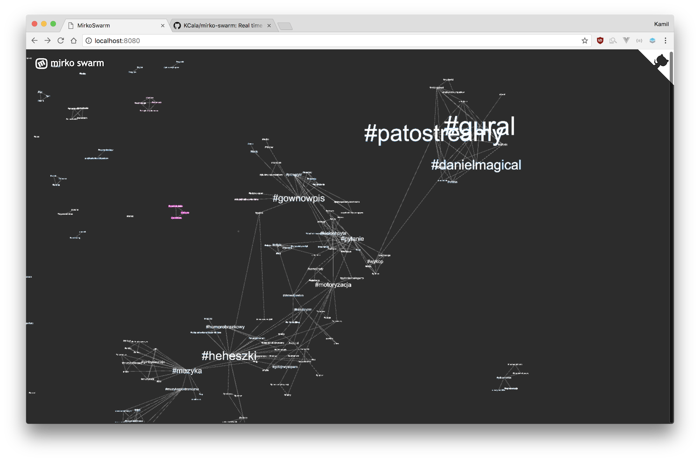

# Mirko swarm
Real time visualisation of users activity on microblog at [Wykop.pl](https://www.wykop.pl).

## About Wykop

Wykop.pl is a polish social website based on digg. User can add links to interesting websites and
articles, comment on them and vote them up or down. The best rated ones appear on
the main page. 

[Microblog](https://www.wykop.pl/mikroblog/)  is the special section of wykop designated to 
short entries, being more about discussing rather than sharing links. Each entry can be marked 
with #hashtags in order to categorize them. It is similar to twitter.

## About the project

Mirko swarm is my side project created for fun & learning. It shows the overview of what's currently
going on on Wykop (which very often hints at what's going on in Poland in general ;).
Constant stream of entries is being displayed on the visualisation (with a slight delay, due to 
Wykop's API's limits). 

Tag appears on screen when someone posts an entry with it, and the more it's
being used, the bigger it gets. If there are more than one tag used in an entry then they
are connected with lines and pulled towards each other, showing which ones tend to appear
together. New entries on tags are higlighted blue (if a guy did it), pink (if a girl's responsible)
or white (if the sex is unknown).

The view can be zoomed and panned. Tags can be dragged and played with as well. Just because.

On standard settings new entries appear in batches every 15 seconds. It can't be done more
often because of API limits.

## How it's done

Backend of the application is responsible for fetching entries from Wykop API periodically,
and serving them in a form of a websocket. It is done using `Akka`, `Akka HTTP` and `Akka Streams`.
Whole project is written in `Scala`.

Frontend receives entries through the webscocket connection and assembles them continually into a graph.
Graph is being handled by `d3-force` simulation, and `Pixi.js` is responsible for rendering it on the
screen using WebGL. `d3-drag` and `d3-zoom` are used to provide interactivity.